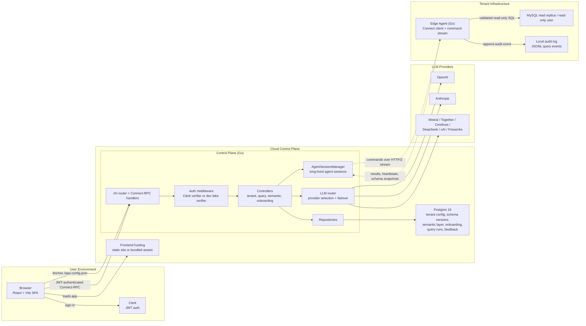
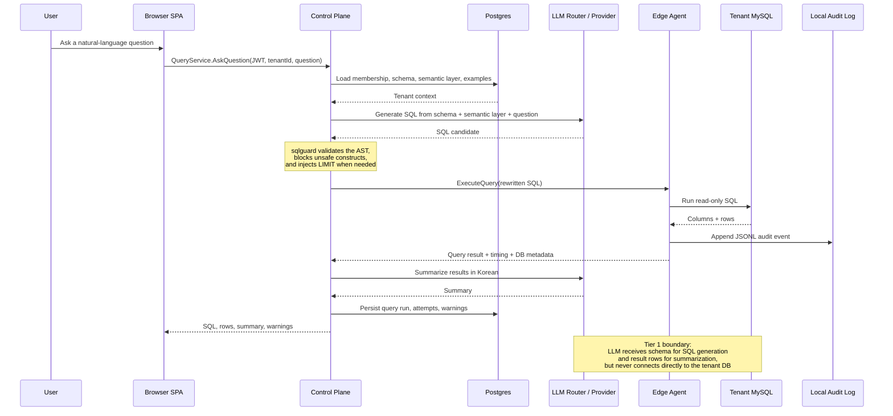
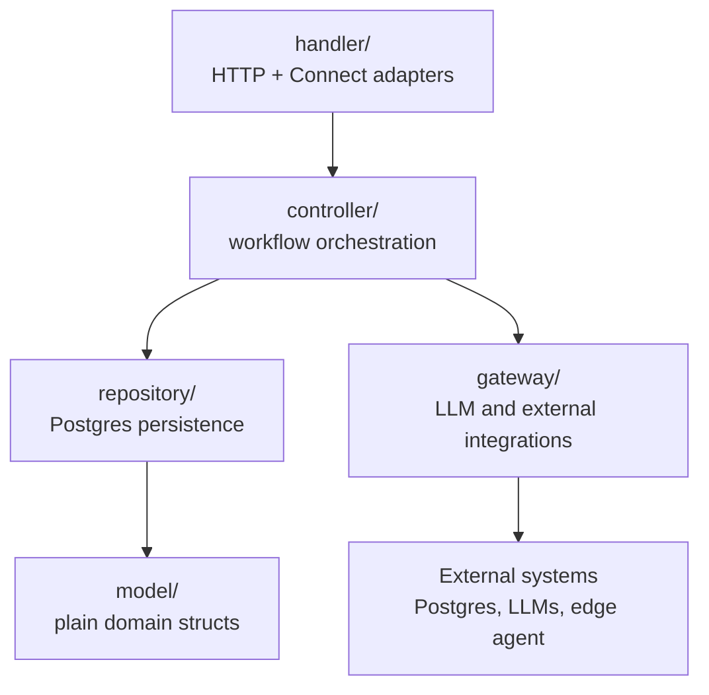

# Architecture Diagram

Generated from the current codebase and architecture docs:

- `ARCHITECTURE.md`
- `README.md`
- `cmd/control-plane/main.go`
- `cmd/edge-agent/main.go`
- `internal/controlplane/controller/query*.go`
- `internal/edgeagent/controller/agent.go`
- `web/src/App.tsx`

## System Context

## Text-to-SQL Request Flow

## Layered Code Shape

